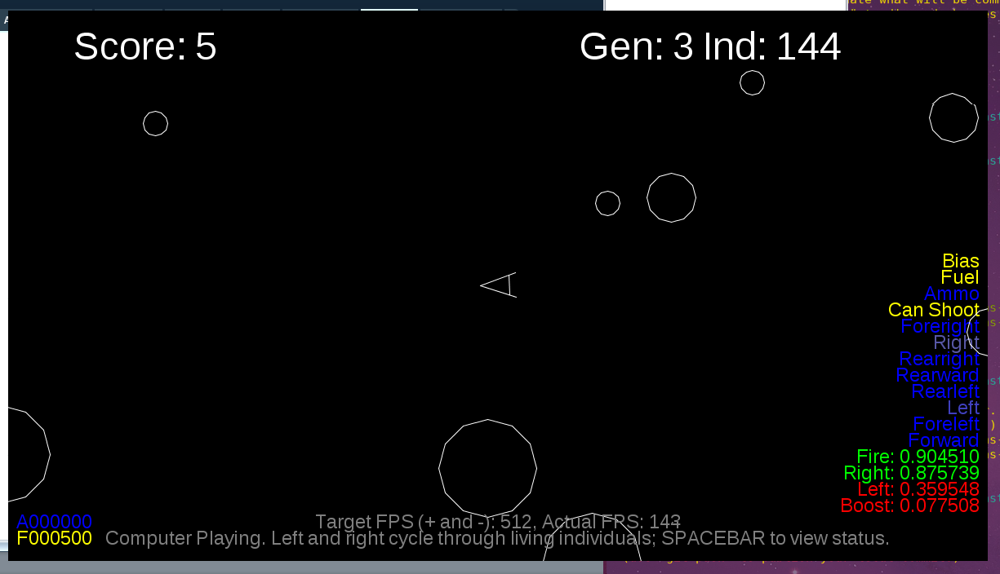

# AsteroidsAI

Source code for an Asteroids-like game and an AI that learns to play it.

This code requires Processing to run.

## How It Works

This code combines a 4-layer neural network with a genetic algorithm.

### Before Play

Prior to the start of play, 200 AIs are generated with totally random neural network weights. These neural networks have 60-node input layers, two 48-node hidden layers, and a 8-node output layers.

### During Play

During play, every instant (frame), the neural networks are fed a few pieces of information:
    - How far the closest asteroid is in each of 8 directions (`1/log(distance)`)
    - How much fuel and ammunition are remaining
    - Whether the weapon has reloaded

Originally, it was just these inputs, computed each frame. Now, in addition, this information is saved for 3 frames in a rolling buffer and fed to the neural networks, effectively giving them a 4-frame "memory".

The neural network gives 8 outputs. 4 of them are used as game controls:
    - Boost
    - Shoot
    - Turn Left
    - Turn Right

The other 4 are actually put into the input memory, so the neural network can "plan" over time, a technique known as a recursive neural network or RNN. Each control output is considered "active" if its confidence value is greater than 90 percent.

Every player has a limited amount of booster fuel and ammunition, so they will all eventually die.

### After Play

After each round (that is, after all players have died), the best player is picked using a combination of survival time, score, and accuracy (hit to shot ratio). The best player is then cloned to prevent regression.  Then players are cloned in a weighted fashion, crossed with each other or the best player, and finally mutated.

The process repeats over and over, eventually (we hope) producing very good players.

## Controls for a Human Player

- SPACE fires the craft's weapon
- UP ARROW fires the craft's booster
- LEFT and RIGHT ARROW fire the craft's rotation thrusters

## Controls for an Evolution Controller

- SPACE switches between displaying a player or the status indicator
- `p` switches to player control
- `+` speeds up the frame rate
- `-` slows down the frame rate
- `d` doubles the mutation rate
- `h` halves the mutation rate
- `b` re-runs the current best
- LEFT and RIGHT ARROW move through the population

